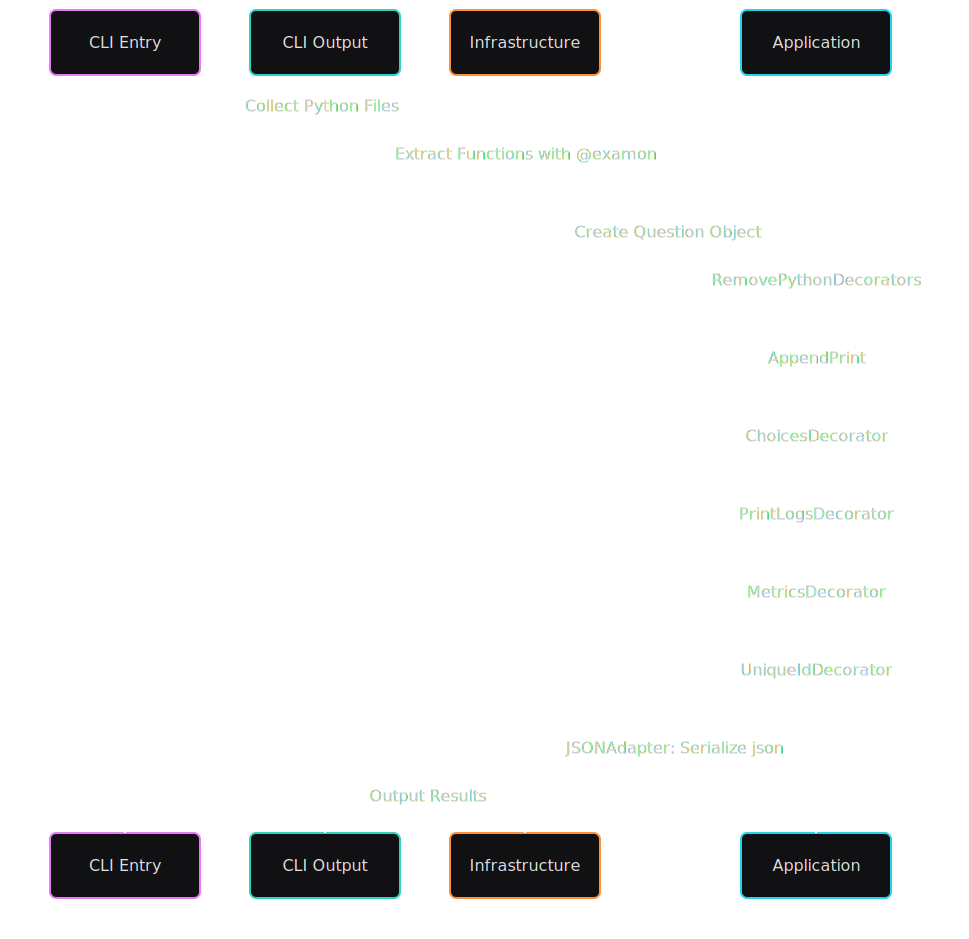

# Examon

Examon is a Python library for reading raw Python functions in the wild and turning them into multichoice questions.

It is designed to work seemlessly with generative AI by:

- Declaring standard input (_Examon Function Format for Python_) format for LLMs to generate that can then processed, enrich and validated with traditional rule based programming
- Creating an output [`Question Schema`](docs/question-schema.json) that can be further enriched to add generative AI content easily that cannot be done by rules based programming:
  - Hints
  - Incorrect answers
  - Categorisation
  - Ability to create more questions similar but of a different difficulty

## Installation

```sh
git clone https://github.com/ExamonOrg/examon-core.git
cd examon-core
poetry install
```

---

## Usage

### CLI

To extract questions from Python files or folders and serialize them to JSON:

```sh
poetry run examon path/to/file.py path/to/folder --file_name output.json
```

- **paths**: One or more files or folders to scan for `@examon`-decorated functions.
- **--file_name**: Output JSON file name (default: `output.json`).

### Example

```sh
poetry run examon tests/fixtures/simple_questions.py --file_name questions.json
```

---

## Examon Function Format Specification (Python)

A function intended for Examon processing must adhere to the following requirements:

1. **Top-Level Declaration**  
   The function must be defined at the top level of a Python module (not nested within another function or class).

2. **Self-Containment**  
   The function must not invoke or depend on other functions or classes declared within the same file. Standard library imported from standard python libs are permitted.

3. **No Arguments**  
   The function must not accept any parameters; its signature must be `def function_name():`.

4. **Return Value**  
   The function must explicitly return a value using the `return` statement.

5. **Decorator Requirement**  
   The function must be decorated with `@examon` from `examon_core.domain.question`.

These constraints ensure that Examon can reliably extract, execute, and generate questions from Python functions.

### Example Function

#### Valid Input Format

```python
from examon_core.examon import examon


@examon(choices=["Hello", "Examon"])
def sample_function():
    return "Hello, Examon!"


@examon(choices=["Hello", "says hello", "{self.name} says hello"])
def sample_function_with_std_lib():
    from dataclasses import dataclass

    @dataclass
    class Pet:
        name: str

        def say_hello(self) -> str:
            return f"{self.name} says hello"

    return Pet("Milo").say_hello()

```

#### Invalid Examples

```python
from examon_core.examon import examon
def another_function():
    return "Missing the examon decorator!"

def sample_function(arg1):
    return another_function()
```

## Architecture



## Examon UI App (Prototype)

The exported json can be used with standalone [React App](https://github.com/ExamonOrg/examon-ui).
Simply rename the file to questions.json and replace the file in public/questions.json


## Customizing the decorators

### Example: Custom Enrichment

```python
from examon_core.application.question_factory import QuestionFactory
from examon_core.application.enrich.function_source_enricher import FunctionSourceEnricher, AppendPrint, RemovePythonDecorators

class CopyrightEnricher(FunctionSourceEnricher):
	def build(self, function_src):
		return "# Copyright ABC 2025\n" + function_src

chain = DecoratorChain(
        [
            DecoratorChain([RemovePythonDecorators(), AppendPrint(), CopyrightEnricher()]),
            ChoicesDecorator(),
            PrintLogsDecorator(UnrestrictedDriver()),
            MetricsDecorator(
                MetricsAnalyser(
                    collector=RadonMetricsAnalysis(),
                    difficulty_classifier=SimpleDifficultyClassifier(),
                )
            ),
            UniqueIdDecorator(UniqueIdGenerator()),
        ]
    )
```

You can then use your customised chain own python script.

```python
# Add imports
chain = DecoratorChain(
        [
            DecoratorChain([RemovePythonDecorators(), AppendPrint(), CopyrightEnricher()]),
            ChoicesDecorator(),
            PrintLogsDecorator(UnrestrictedDriver()),
            MetricsDecorator(
                MetricsAnalyser(
                    collector=RadonMetricsAnalysis(),
                    difficulty_classifier=SimpleDifficultyClassifier(),
                )
            ),
            UniqueIdDecorator(UniqueIdGenerator()),
        ]
    )

def main(paths: tuple[str, ...], file_name: str) -> None:
    files = FileCollector().collect_files(list(paths))
    results = []
    for file in files:
        with open(file, "r", encoding="utf-8") as f:
            examon_functions = [
                chain.decorate(question)
                for question in FunctionCollector().extract(f.read())
            ]
            if examon_functions:
                results.extend(examon_functions)

    JSONAdapter().convert(file_name, results)
    click.echo(f"File generated: {file_name}")
```

---

## License

MIT
